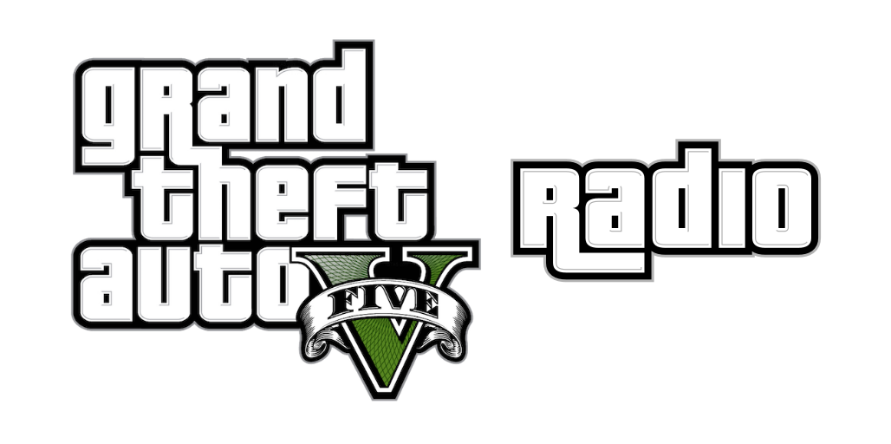

[][site_url]

[![Github pages][github_pages_badge]][site_url]

# GTA V Radio
Recreating every GTA V radio station, playable in your browser

## 🛠️ Features

* [x] Website backgrounds
* [x] Media controls
* [x] Media session info
* [ ] Currently playing track title/artist
* [ ] Radio settings menu 
* [x] Radio synced to real time
* [x] Static stations (e.g., East Los FM)
* [ ] Talkshow stations
  * [x] Main audio track
  * [ ] Advertisements
  * [ ] News
* [ ] Dynamic stations
  * [x] Main audio track
  * [x] Track intros 
  * [ ] Advertisements
  * [ ] News
  * [ ] Takeovers (e.g., Dre Day, iFruit Radio Skepta playlist)
* [ ] Radio stations:
  * [x] Base game stations
  * [ ] Self Radio
  * [x] The Lab
  * [x] Blonded Los Santos 97.8 FM
  * [ ] Los Santos Underground Radio
  * [ ] iFruit Radio
  * [x] Still Slipping Los Santos
  * [ ] Kult FM 99.1
  * [ ] Music Locker Radio
  * [ ] Audio Player
  * [ ] MOTOMAMI Los Santos

## 📚 Related Projects
- Organized radio station game data dumps - [HintSystem/GTA-V-Radio-Dumps](https://github.com/HintSystem/GTA-V-Radio-Dumps)
- Final radio station data and audio - [RegalTerritory/GTA-V-Radio-Stations](https://github.com/RegalTerritory/GTA-V-Radio-Stations)

<!-- Readme links -->

[site_url]: https://hintsystem.github.io/GTA-V-Radio
[github_pages_badge]: https://img.shields.io/badge/GitHub%20Pages-222222?style=for-the-badge&logo=github&logoColor=white